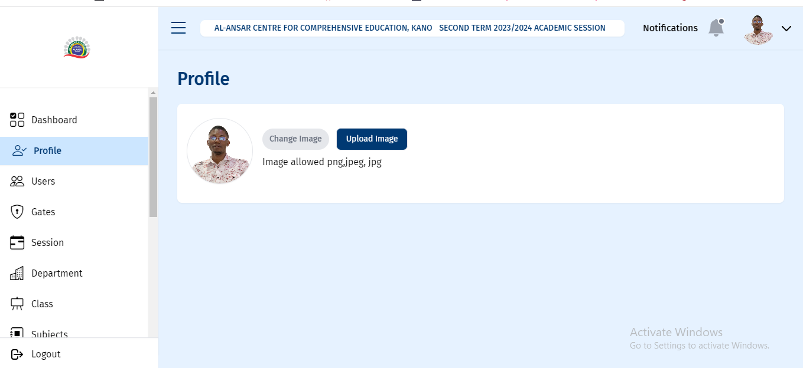
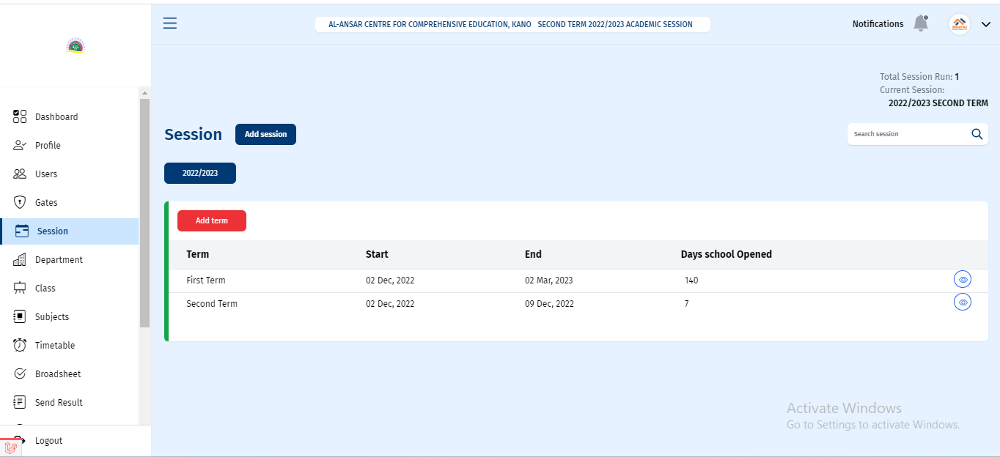
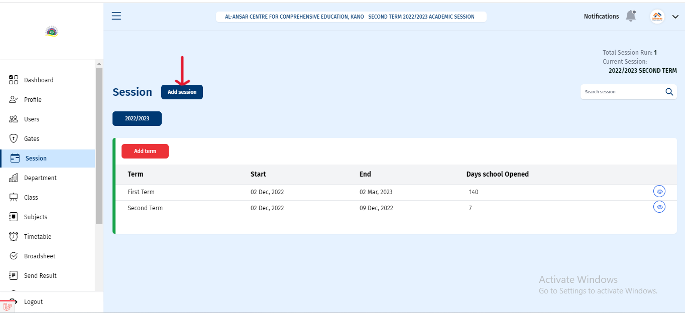
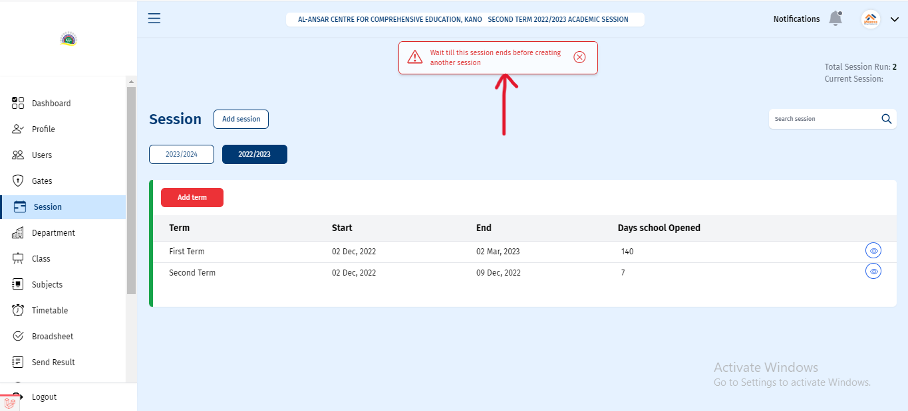
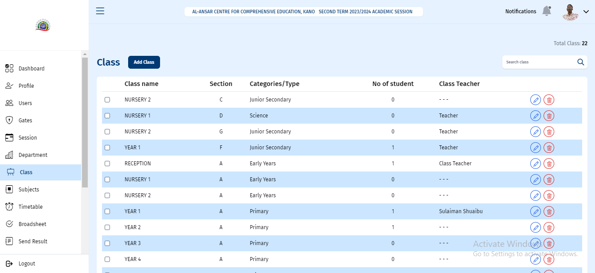

# DOCUMENTATION OF MEERAS SCHOOL MANAGEMENT SYSTEM

## INTRODUCTION

Meeras School Management System is an information management system for managing student data in educational institutions. It facilitates teachers' access to student data and lightens their workload. Information about students such as their exam grades, parent information, tuition fees etc, is contained in student database in the school management system.

Student registration, class materials, grades, analytical grades for students, and other assessment components are all provided by this system. This document is to show the reader on how to navigate the application and get the best out of the application in general.

There will be image descriptions of the various components on each web page and explanations on how to get the most out of them.

There are school staffs that can make use of the management system they include:

1. The School Administrator
2. The Teacher
3. The Class Teacher
4. The Head of School
5. The Accountant

In this documentation the usefulness of the management system will be explained for all users starting from the school administrator.

# ADMINISTRATOR ROLE IN MANAGEMENT SYSTEM USE

### LOGIN PAGE

This is a sample of the page that would appear when the _LOGIN_ page at [https://portal.acce-kano.ng/] is accessed. You can log in your _school ID_ or _email address_ and _password_.

In the image above, there is a **LOGIN** option that allows the user to either use a valid **School ID** or a valid **email address**. Below that, there is a checkbox that serves as a reminder once logged in and a "forgot password" option in case the user forgets their password.

### DASHBOARD PAGE

After successfully logging into the school management system, the dashboard page - the first page we can access, has a number of components which we should pay close attention.

Both a hamburger menu and a sidebar are available for switching between tabs and pages. Additionally, there is a navigation bar at the top with links to the user profile and notification navigation. These are consistent throughout the application

Six widgets are available to show additional information. The balance remaining after deducting expenses and income is displayed in the first row of widgets. Various notification tabs are displayed in the second row and third rows.

### THE PROFILE PAGE

The user profile of the currently logged-in administrator, which includes an image and a button to upload an image, is displayed in the profile tab.

So after successfully setting profile details, we can head straight to the next step, which is to create a class. We create a session and tab so we can add users. Such as the _students_ , the _staffs_ as well as _parents_.

### CREATION OF SESSION

On this page, there is information on when a session starts and ends, the terms the school has, as well as the session duration (days the school is open). A session has to be created before a class can be created for students and staff. To create a session, just click on the button “_Add session_.” After the creation of a session, terms can be created as well.

In order to create a session, there is an “_add session_“ button. Also, after creating a session, terms can be added using the red "_add term_" button shown below.

#### NOTE:

If there is a current session running and has not finished a new session cannot be created as an error message as shown in the image below will be shown.

### CLASS PAGE

In order to properly use the system, before the addition of a student , staff member, or parent, a class must be created first. to do this there is a class navigation which is the class tab and it navigates us to this page shown in the below image , there are some components
On this page, such as the search bar, the text showing the total number of available classes, and the add class button, The uses of this components will be explained individually.

### The add class button

This component button allows us to add a class to the system; however, in order to add students, their parents, and staff members who are associated with the class, a class must first be created.

### Note:

Note: when creating a class it is optional to create a class teacher but later a class teacher can be added by clicking the edit button on the right hand side with the colour blue.

Clicking the _Add Class_ button displays a dialog box like below

Clicking on _School Type_ gives us the list of various schools available.

After choosing the _School Type_, an option to choose the specific year or class as the section and the class teacher appears. Then click the _Add Class_ button. A Class is created.

The successful creation of a _Class_ makes a dialog box to to show on the screen, saying : _Class created successfully without class teacher_. Teacher can be added later.

### ALERTS

Most successful alerts notification on the system is in form of a toast message shown below.

### The Search button and Total number of Classes created

Demonstrates how to search for a specific _class_ and the total number of classes offered on our class page is shown as a text just above the search bar.

### THE USERS PAGE

The users page allows admin to register staff, parents, and students in the system.
The user's page contains some elements that would enable us to accomplish this; those elements are described below.

// To change the image

### THE STAFF PAGE

When one accesses the users page, there are three navigation links that lead to three different pages within the users page, and each navigation link has a blue border at the bottom to show the active link, allowing one to identify the current page one is on.

Beginning with the _staff page_, there are seven columns: _staff ID_, _position_, _status_, _email_, and the last column, which includes _icons_ for calling and deleting.

The _staff page_ allows to add a staff member to the system, collecting information such as their _first name_, _last_ _name_, _email_ _address_, _phone number_, and _position_, after clicking on the “add staff” button as shown in the image below.

### After clicking the "Add Staff" button, this form pops up.

There are various positions that the _staff_ can be assigned to following the completion of the _form_. A welcome _email_ is sent to the email address provided by the _staff_ for registration; this _email_ contains the _staff's_ new password; however, upon registration, the default password is "_password_," all in small letters. The staff can now proceed to change the password to his or her desired one. Note that this email must be valid and has not been used for any registration on the system before.

An image below shows the type of email sent to the staff.

### What the page looks like after selecting multiple checkboxes.

On the left-hand side, there are some checkboxes that allow us to select a _staff_ or _multiple staff_. After selecting these _staff_, two red buttons will appear on the left of the page , as well as two transparent buttons on the right.

Starting from the two red buttons, one shows the total number of _staff_ selected, and the other allows you to delete the selected checkboxes.

When you click the _delete_ button, a confirmation modal appears, asking if you are certain about the action you are about to take (see image below). When the _Go Ahead_ button is pressed, the selected multiple record of the staff is deleted.

On the right hand side of the page, there are two rounded icons: the first is a call _Icon_, and the second is a _delete Icon_.

The _call icon_ enables the user to be able to call the _staff member_ whose record is the current row hovered. On the other hand, the delete button helps us delete the record of the _staff_. After clicking the button a modal as well pops up requesting confirmation for the initiated action:

This is the modal, and clicking "_Yes, delete it_” deletes that individual record.

On the right hand side it will be noticed that there are two transparent buttons which we can use to export the selected _staff_ record either as an _excel_ file or as a _pdf_ document file.

Finally, there are some texts that displays the _total number of staff_ and the _active staff_.

### THE PARENT’S PAGE

There is also the _parent_ page. This page is similar to the staff page, but there are some differences. This page includes an "_Add Parent_" button as well as _five columns_ that display important information about the _parent_. This column contains the _parent's name_, the _parent ID_, the _number of children the parent has in school_, the _parent's email_, and the last column with a _call_ and _delete icon_. There is also a _search bar_ to search for _parents_ and a _text box_ to display the _total number of parents registered_. In order to add a student,

After registration of a _parent_, a _welcome email_ is sent just like when a staff is created. This _email_ includes the _parent’s password_, and in the same way as the _staff_, the _default password_ is password,” all in small letters.

### NOTE:

It is important to first add a _parent's_ details; otherwise, it will not be possible to add a student to the student page.

Starting with "_add parent_," when the button is clicked, a modal and a backdrop appear. This modal includes a form that collects data about the parent, as well as validation if information was not properly filled out or an input was omitted. After the successful addition of the _parent_, there is a feedback toast to show success.

The registration of a _parent_ enables the _administrator_ to be able to send results as well as other useful information about their corresponding children to his/her _mail_.

### THE STUDENT’S PAGE

After successfully adding a _parent_, we can proceed to the _student page_ to add a student. On the parent page, there are six columns that contain the student's record, which include the _student's name_, _the student ID_, the _student's class_, the _student's date of birth_, the _student's status_ (whether active or not), and an eye and delete button. There is also a button called the “_Add Student button_”

### “Add Student” BUTTON

On clicking the "_Add Student_" button, there will be a modal that includes a form and two separate input fields, which are options to add a student by their _parent's ID_ or the _parent’s email_.

If, per adventure, the _user_ has not added a _parent_ on the _parent page_, a text “_if parent is not registered yet_?” and a link “_add parent_” can be seen below the form. As it is necessary to be able to add the student to the system, to finish this process, click the link on this form to return to the parent's page to make the necessary registrations.

If the _ID or email_ is valid, another form with the _parent's name_ entered will be displayed.
To get the _parent ID_, we can go to the "_parents_" page and see each _parent ID_ in the _parent ID_ column. Finally, this form collects student information and includes validation in the event of incorrect input. After entering the necessary information and submitting the form, the student is added to the system, and success feedback is received in the form of a toast.

On the left-hand side are checkboxes that can be used to _delete multiple students_ from the system. Also in the sixth column, there is a delete button on every record of a single student to delete that _student's_ record. Just like the one on the parent page explained previously.

### STUDENT DETAIL PAGE.

On the sixth column there is an _eye icon_, which is a button that can be clicked and navigates to the student’s detail page, where full details about the student are shown.

On this page, there are the _student's bio-data_ as well as the student’s guidance information and other necessary information for the student.

On this page there is an "_edit profile_" button that enables editing of the student details. By clicking the button, you will be taken to another page where you can update the _student's information_.

### THE GATE PAGE

The next page’s navigation tab on the sidebar is the _Gate navigation_, which leads to the _Gates page_. This page is important to assign roles to staff. At the beginning of the page, there is a search input that helps to search a staff by _ID_ and also a drop-down input that enables you to add roles to a _staff_. Also at the top right-hand side of the page are details about the total number of staff assigned to a role, the total number of roles available, and the total number of users.

At the top of the page, there are two inputs for assigning a role to a person: entering their _staff ID_ and _selecting the desired role_. When the red button is pressed, the role is assigned to a member of staff.

After clicking the input with the placeholder of “_role_” as shown in the image below, various role assignable to staff will be shown

As shown in the image below, a single staff member can be assigned to more than one role.

If a _staff_ member has more than one role, the staff member can be unassigned from a single role by clicking on the cancel icon on each of the roles.

A confirmation modal shows to confirm the action, as shown below:

Also, all tasks assigned to a _staff_ member can be removed by clicking the "_revoke all_" button. This automatically removes all roles associated to a _user_.

After clicking the "_revoke all_" button, a modal appears to ask for confirmation that the action to be taken is certain; once clicked, the "_yes remove all_" button is removed. All roles are removed from the staff.

Lastly, there is a text description on the page showing the _total roles_, _total users_, and _total users_ with roles on the page.

### SUBJECT PAGE

The _Subject page_ allows us to create a subject for use in the school system.
The table on this page displays information about the _subject_, ranging from the _subject teacher_ to the _school type_ and _class_. A new subject can be added to the system by first filling in the input box with the placeholder "_enter subject_" with the desired subject, then selecting the required _department_ (which is optional), and finally clicking on the "_add subject_" button.

The total number of _subjects_ that are available in the system is shown on the page, as shown in the image below.

A _Teacher_ can be assigned to a subject. But this teacher which is to be added must have been already added in the _staff page_ so their details will be shown when a subject is to be assigned. To assign a subject there is a “_assign subject_” button that enables already registered staff (teacher) on the users page to be assigned a subject based on their class.

### TIMETABLE PAGE

The time-table page allows timetables to be created for class scheduling. It should be noted that before a class schedule can be created, the teacher, who is a staff member, and the subject must be determined, as previously explained. The table page includes some features that allow the administrator to schedule a class time. Assign a teacher to that class as well. There is a "create timetable" button at the top of the page.
This button allows the _administrator_ to _create a timetable_. There is a list of buttons seated side by side on the main section that shows the list of classes in the system. To view a timetable for a particular class just click on a class shown on the list and the class timetable will be displayed.

After clicking the create button,the form must be filled out with the class, the subject, the teacher who will teach the class, and the day and time that the subject will be held. A class schedule is successfully created after filling out and submitting the form.

### BROADSHEET PAGE

The _broadsheet_ for a specific class and subject can be generated on the broadsheet page; shown with a red arrow above are the input dropdowns to be filled for a specific class and subject; after choosing these, clicking on the "generate broadsheet" button results in a broadsheet for the specified inputs requested.

### NOTE: in order to be able to generate a broadsheet for a class and a subject the class and subject must have been created on the class page and subject page described previously.

###

TEACHERS ROLE IN THE SCHOOL MANAGEMENT SYSTEM USE.

#### SEND RESULT PAGE

This page shows a list of classes and the total number of students in those classes, as well as a “_send result_” button for each class. This button enables the administrator to send the results of students in a particular class to their corresponding _parent's email_, which was registered on the parent’s page.

After the send result button has been clicked a modal shows , describing the success of the mail sent to parents of a particular class as shown on the image below:

### FEES PAGE

On the _fees page_, the _administrator_ can keep track of the various _fees_ available at the school as well as provide details about the fees such as the session and term in which the fees are to be paid, the class for which the fees are intended, the amount for the fees, the number of times the payment is made (payment made), and the sum of the payments for the particular fee. This page is important for the payments page so this details about the fees must be created before proceeding to the payment page.

On clicking of “_add fee_” button a modal with a form comes up to collect data related to the desired fee to be added to the system, after successfully filling and adding the fee the information is included on the _fees_ page.

### PAYMENTS PAGE

The _payment page_ is an important page to keep track of payments made for a particular fee. The payment page includes details about the person who the fee was paid for , the payment type (this is with regards to the type of fees filled on the fees page) the amount paid , the method of payment , the date of payment and lastly the payment status weather successful or failed:

On clicking on the add payment button a form comes up with so details about the new fee can be added to the system.

### TEACHERS ROLE IN EDUCATION MANAGEMENT SYSTEM USE

The role of a teacher in the school management system will be explained in this module. To log in as a teacher, the teacher must have his/her school ID or a valid email address, which was provided during registration by the admin. Immediately after registration, a message will be sent to the provided email address with the password to be used to log in to the system, which can be changed to a desired password, but the default password is "password." With this criteria, the teacher can login to the management system.
An example of an expected mail is shown in the image below.

### THE DASHBOARD PAGE

When logged into the admin dashboard as a teacher, this is the first page you see, which is the dashboard page. The dashboard page displays
This page contains vital information for a teacher, such as the total number of students, the number of active classes, and the total number of subjects taught.

Also on this page are the names of all the students registered under the classes in which the teacher is taking and a timetable that shows all the classes assigned to him/her throughout the days of the week.

### THE PROFILE PAGE

The next page after the dashboard is the profile page in which the logged in teacher can update his/her profile images and other important personal details.

### THE SCORES PAGE

The score page is a page that enables the teacher to edit and grade each student according to their score. On the score page's top left-hand corner, there are two buttons whose purpose will be explained: check score inputs and submit. Under the two buttons is a row of subjects the teacher takes and, lastly, the scores of each student.

Starting from the two inputs on the left hand side, teachers can filter by session and by term. On clicking on the input, a list of terms and sessions is displayed for viewing and possible editing. Through this, the teacher can be able to select a subject and view the total students and their scores.

To view the scores of all students in the class for a specific subject, there is a list of subjects side by side, and clicking on a subject displays a blue active button color and filters out the scores of all students who offer that subject from highest to lowest.

To alter the score of an individual student, click on the edit button on the right-hand side. A form will appear, allowing the teacher to edit the required scores. The CA1 means “continuous assessment 1," and the CA2 means “continuous assessment 2.”

### The Documents Page

This page enables the teacher to update his or her profile, such as name, image, and some important documents. for the teacher.

### CLASS TEACHERS ROLE IN MANAGEMENT SYSTEM USE

In the school management system, the class teacher also has a special role and a special login role. The class teacher, after registration, can login to the management system with his or her email or registration ID. The dashboard page allows the teacher to view the class that is assigned, the total number of students that the teacher has, as well as the active ones. This page also shows the total subjects assigned to that teacher, a long list of his students, and lastly, the schedule for the class teacher.

The image below is a typical page of a class teacher not assigned to any subject or class but given the role of class teacher on the system.

Another image below shows the class teacher assigned to a class with students, a subject, and a schedule.

### Profile page for the class teacher

After the dashboard page is the profile page for the class teacher, where he or she can upload his or her details. carefully uploading his or her images for the dashboard.

The document page is basically for the class teacher to upload necessary documents.

